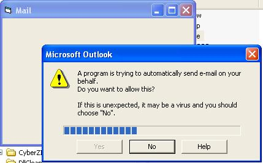



## Auto Click YES when Outlook's Security Guard opens prompt dialog

### Description

This program will clicks the Yes button on behalf of you, when Outlook's Security Guard opens prompt dialog saying that a program is trying to send an email with Outlook or access its address book.

This had been tested for

Outlook 2000 SP1+SR1

Outlook 2000 SP2

Outlook 2002

ByPassMSOutlook

Written by Mohamad Rawey Chek Ani, Perlis, Malaysia

mrawey@yahoo.com.my

If you use this application then please mention me in your credits.

Thanks and enjoy, Please also vote for me :-)
 
### More Info
 

             |
---                |---
**Submitted On**   |2004-06-02 10:50:24
**By**             |[mrawey](https://github.com/Planet-Source-Code/PSCIndex/blob/master/ByAuthor/mrawey.md)
**Level**          |Advanced
**User Rating**    |4.9 (68 globes from 14 users)
**Compatibility**  |VB 5\.0, VB 6\.0
**Category**       |[Miscellaneous](https://github.com/Planet-Source-Code/PSCIndex/blob/master/ByCategory/miscellaneous__1-1.md)
**World**          |[Visual Basic](https://github.com/Planet-Source-Code/PSCIndex/blob/master/ByWorld/visual-basic.md)
**Archive File**   |[Auto\_Click175295622004\.zip](https://github.com/Planet-Source-Code/mrawey-auto-click-yes-when-outlook-s-security-guard-opens-prompt-dialog__1-54150/archive/master.zip)

